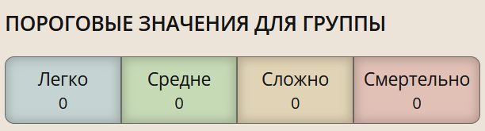
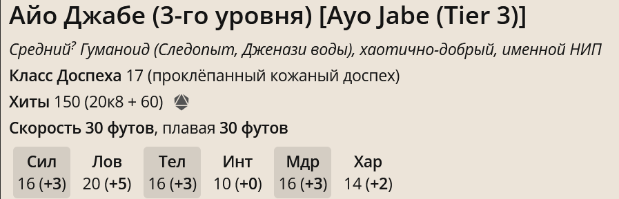

## Что нужно сделать?

### 1. Изучить бестиарий
- **Не придумывать собственных мобов**: Использовать только существующие мобы, чтобы сохранить баланс игры.
- **Фактические характеристики**: Характеристики мобов должны быть аналогичны характеристикам персонажей.
- **Хиты противника**: Определять хиты с помощью вероятности (например, для бандита использовать 2к8).

### 2. Изучить объекты мира
- **Типы объектов**:
  - Вещи
  - Расходники
  - Артефакты
- **Градация по качеству**: Разработать систему классификации объектов по качеству.
- **Выборка артефактов**: Составить список используемых артефактов для нашей кампании и подробно их описать.
- **Предоставление игрокам**: Ознакомить игроков с артефактами.
- **Генерация задач**: Создать систему генерации задач по сложности и случайных квестов.

### 3. Прочитать
- [Как начать играть в D&D](https://dnd.su/articles/newbie/536-how-to-start-playing-dd/)
- [Основные формулы](https://dnd.su/articles/newbie/26-main-formulas/)
- [Использование характеристик](https://dnd.su/articles/newbie/468-using-ability-scores/)

### 4. Обработка игрового окружения
- **Новые листы персонажей**: Распечатать новые листы персонажей, так как предыдущие были заполнены неправильно.
- **Расчёт брони**:
  - Использовать информацию из [статьи о броне и снаряжении](https://dnd.su/articles/inventory/147-armor-arms-equipment-tools/?ysclid=m5wjhldpb3222781532).
  - Учитывать типы урона.
- **Создание строгих правил повествования**:
  - Установить ограничения для общения игроков (например, не в одном помещении без определённых условий).
  - Обсуждение плана заранее и совместно.

